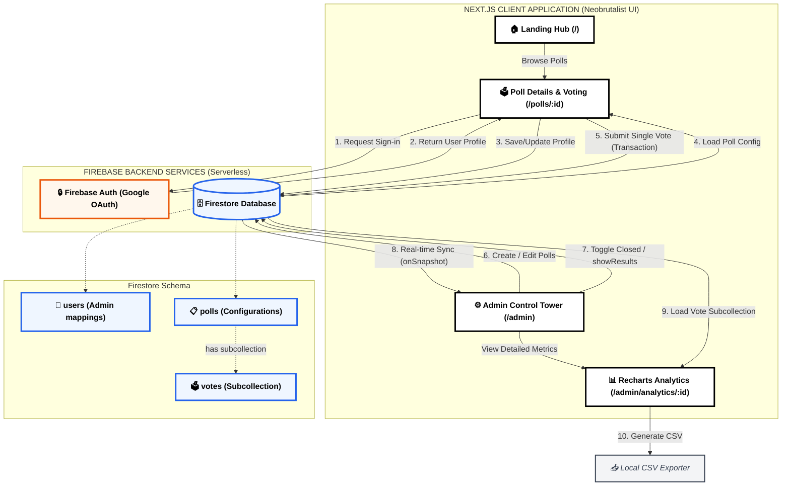

# 🗳️ E-Cell Polling – Secure Real-time Polling & Decision System

[](https://nextjs.org/)
[](https://react.dev/)
[](https://firebase.google.com/)
[](https://tailwindcss.com/)
[](LICENSE)

A modern, fast, and interactive polling and voting platform built with **Next.js 16**, **React 19**, **Tailwind CSS v4**, and **Firebase (Firestore & Auth)**. It enables administrators to create, edit, and manage polls, track user responses in real-time, view detailed analytical breakdown of option shares, and export voting results directly for E-Cell BVUDET Navi Mumbai club decision-making, events, and elections.

---

## 🚀 Key Features

* **🎨 Dynamic Poll Builder & Manager**: Create, edit, and organize polls with custom descriptions, categories, header banner images, and multiple-choice options. Manage poll settings directly (like opening, closing, or displaying results).
* **⚡ Real-time Save & Authentication**: Ensure votes are recorded securely. Google Authentication restricts users to one vote per poll, automatically recording user details (UID, name, email) to prevent double voting.
* **📊 Control Tower & Analytics**: Administrators have a detailed dashboard to monitor polls, analyze vote distribution and percentage share via dynamic Recharts (Bar and Pie charts), and inspect a detailed voting record table.
* **🏆 Results Visibility & CSV Export**: Toggles to show or hide results for voters before/after a poll is closed. Features a button to export detailed voting records and poll analytics directly to CSV.
* **🔒 Secure Firebase Firestore & Auth**: Secure routes for admin dashboards (`/admin` and `/admin/analytics/[id]`), protecting routes and restricting unauthorized actions.
* **💎 Neobrutalist UI/UX**: High-contrast, premium, responsive layout featuring clean borders, bold colors, custom typography (Space Mono, Inter), and micro-interactions.

---

## 🛠 Tech Stack

* **Framework**: [Next.js](https://nextjs.org/) (App Router, TypeScript)
* **Frontend library**: [React](https://react.dev/)
* **Styling**: [Tailwind CSS v4](https://tailwindcss.com/) (using `@tailwindcss/postcss`)
* **Backend / Database**: [Firebase Firestore & Auth](https://firebase.google.com/)
* **Analytics Charts**: [Recharts](https://recharts.org/)
* **Icons**: [Lucide React](https://lucide.dev/)

---

## 🏁 Getting Started

### 📋 Prerequisites

Ensure you have the following installed:
* [Node.js](https://nodejs.org/) (v18.x or later recommended)
* [npm](https://www.npmjs.com/) or yarn/pnpm

### ⚙️ Installation

1. **Clone the repository**:
   ```bash
   git clone https://github.com/anshvermadev/voting-system.git
   cd voting-system
   ```

2. **Install dependencies**:
   ```bash
   npm install
   ```

3. **Configure Environment Variables**:
   Create a `.env.local` file in the root directory and populate it with your Firebase API keys:
   ```env
   # Firebase Config
   NEXT_PUBLIC_FIREBASE_API_KEY=your_firebase_api_key
   NEXT_PUBLIC_FIREBASE_AUTH_DOMAIN=your_firebase_auth_domain
   NEXT_PUBLIC_FIREBASE_PROJECT_ID=your_firebase_project_id
   NEXT_PUBLIC_FIREBASE_STORAGE_BUCKET=your_firebase_storage_bucket
   NEXT_PUBLIC_FIREBASE_MESSAGING_SENDER_ID=your_firebase_messaging_sender_id
   NEXT_PUBLIC_FIREBASE_APP_ID=your_firebase_app_id
   ```

4. **Run the Development Server**:
   ```bash
   npm run dev
   ```
   Open [http://localhost:3000](http://localhost:3000) in your browser to view the application.

---

## 📖 Usage Guide

### 1. Setting up Firebase Firestore
This project requires Firestore to store data. Create the following two primary collections:
* `users`: Stores user credentials and privileges. To make a user an Admin:
  - Create a document with ID matching their Firebase Auth UID.
  - Set the field `isAdmin` to `true`.
* `polls`: Stores poll configurations and choices, as well as a `votes` subcollection under each poll to track user votes.

### 2. Seeding Initial Polls
To quickly populate your database with sample polls for testing:
* Sign in to the app, then navigate to `/seed` in your browser.
* Click **Seed Initial Polls** to populate sample polls (e.g. Best AI Innovation, Most Impactful EdTech Tool, Blockchain Use Case of the Year, Sustainability Innovation Award).

### 3. Administrator Workflow (Admin Control Tower at `/admin`)
* **Create/Edit Polls**: Go to the Control Tower dashboard and click **CREATE POLL**. Enter poll details (title, category, description, header image URL, deadline) and options. You can also edit existing polls on the fly.
* **Toggle Poll Settings**:
  - Close/Open: Toggle whether the poll accepts new submissions.
  - Results Visibility: Toggle `showResults` to determine whether users who voted can see the real-time breakdown of votes.
* **View Analytics & Detailed Records**: Click the analytics icon next to any poll to view real-time charts showing vote distribution and percentage share.
* **Export CSV**: Download a spreadsheet summary of overall polls or detailed user-by-user votes for a specific poll.

### 4. Voter Workflow (Voting at `/polls/[id]`)
* Users explore open polls on the home hub and log in securely via Google Authentication.
* Select an option and click **SUBMIT VOTE**.
* If `showResults` is enabled and they've voted, they will see a visual progress breakdown of the votes.

---

## 🔄 System Architecture & Data Flow

This application is built as a serverless voting system connecting client-side poll voters, interactive admins, and a real-time Firestore database.

### 📐 High-Level Architecture & Flow



### 🗄️ Database Schema & Relationships

1. **`users` (Collection)**: Stores registered profiles.
   - `uid`: Unique User ID (Firebase Auth UID)
   - `name`: Display name
   - `email`: Registered email address
   - `isAdmin`: Boolean flag granting access to the `/admin` dashboard

2. **`polls` (Collection)**: Stores poll options and configurations.
   - `id`: Unique Poll ID/Slug (auto-slug generated based on the title)
   - `title`: Name of the poll
   - `category`: Classification category (e.g. "ARTIFICIAL INTELLIGENCE")
   - `description`: Detailed text context of the poll
   - `headerImage`: URL of the banner image
   - `createdBy`: Identity of the creator admin/committee
   - `deadline`: Expiry date string
   - `totalVotes`: Number of votes cast
   - `options`: Array of `PollOption` objects:
     - `id`: Option ID (e.g. `opt1`, `opt2`)
     - `text`: Display text for the option
     - `votes`: Counter of votes for this option
   - `voters`: Array of voter emails (to prevent double voting in frontend/UI context)
   - `isActive`: Boolean flag
   - `isClosed`: Boolean flag (true when polling is closed)
   - `showResults`: Boolean flag (true if users can see result percentages after voting)

3. **`polls/{pollId}/votes` (Subcollection)**: Stores individual user votes.
   - Document ID: UID of the voter (enforces one vote per user)
   - `userId`: Voter's UID
   - `userName`: Name of the voter
   - `userEmail`: Email of the voter
   - `optionId`: Selected option ID
   - `timestamp`: ISO Date/Time string of voting

---

## 👥 UX Flow (User Journeys)

```
[ ADMIN JOURNEY ]
   Login as Admin -> Control Tower -> Create Poll -> Add Options & Banners -> Publish Poll -> Monitor Submissions in Real-time -> Toggle Results Visibility -> Export Detailed CSV

[ VOTER JOURNEY ]
   Explore Open Polls -> Google Login Challenge -> Cast Vote -> Real-time Autosave -> See Vote Confirmation -> View Live Chart breakdown (if enabled)
```

### 1. The Admin Experience
* **Control Tower Dashboard**: Provides instant visibility into poll states (Total Votes, Deadline, Closed, Results Shown).
* **Visual Poll Creator**: Allows admins to add, edit, and delete options, with auto-slug generation based on the title.
* **Interactive Analytics**: Displays vote counts, percentage share, and detailed voter lists with option choice and timestamp.

### 2. The Voter Experience
* **Zero-Friction Authentication**: Simple login with Google and automatic register logic.
* **Voter Security**: Strict enforcement of one vote per user via Firestore transaction checks.
* **Real-time Results**: Live update of percentage progress bars as the community participates (if allowed by admin).

---

## 🤝 Contribution Guidelines

Contributions are welcome! Please read our [CONTRIBUTING.md](CONTRIBUTING.md) to learn how to propose changes, report bugs, or submit pull requests.

To get started with contributions:
1. Fork the Project
2. Create your Feature Branch (`git checkout -b feature/AmazingFeature`)
3. Commit your Changes (`git commit -m 'Add some AmazingFeature'`)
4. Push to the Branch (`git push origin feature/AmazingFeature`)
5. Open a Pull Request

---

## 🛠 Support & Help

If you run into issues or have questions:
* Refer to the Next.js [official documentation](https://nextjs.org/docs) for framework queries.
* Refer to the Firebase [official documentation](https://firebase.google.com/docs) for database/authentication queries.

---

This project is licensed under the terms of the MIT License. See [LICENSE](LICENSE) for details.
